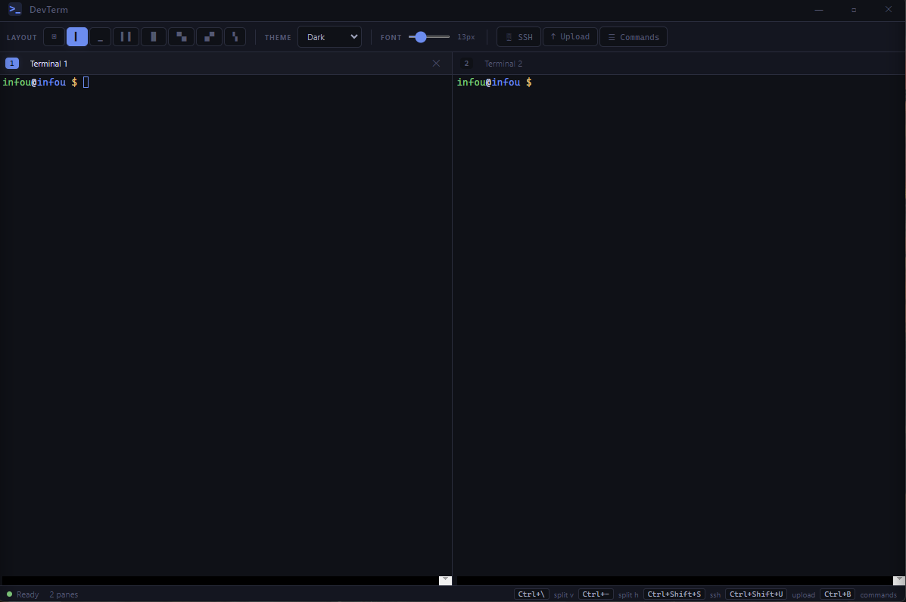
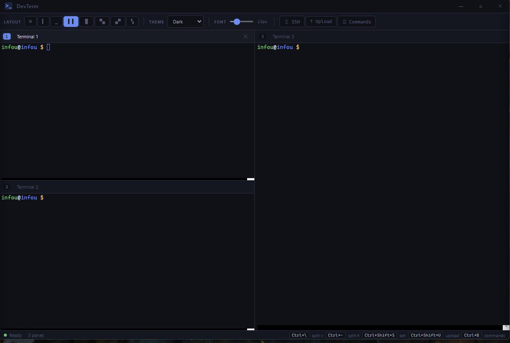
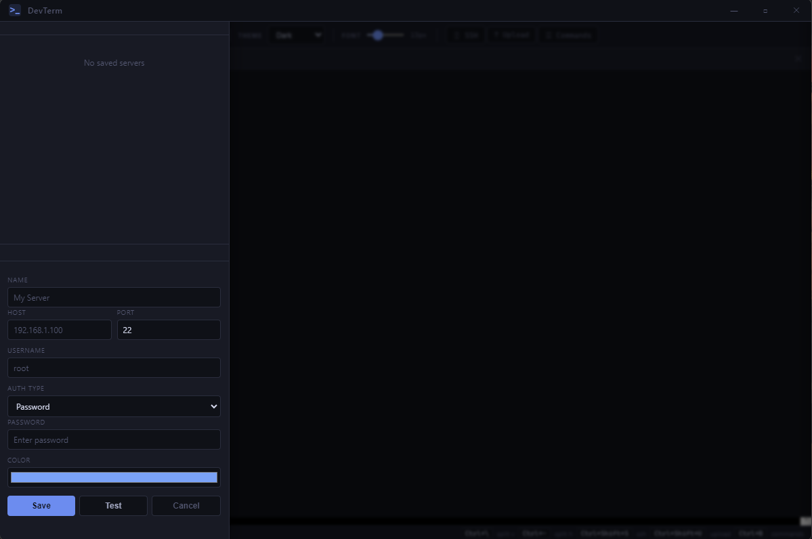
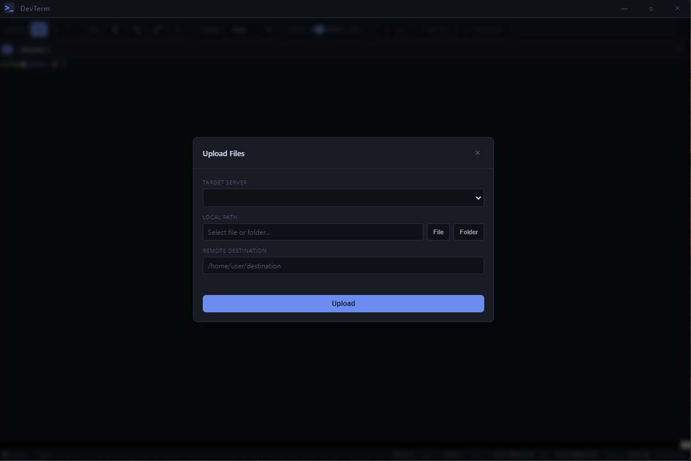
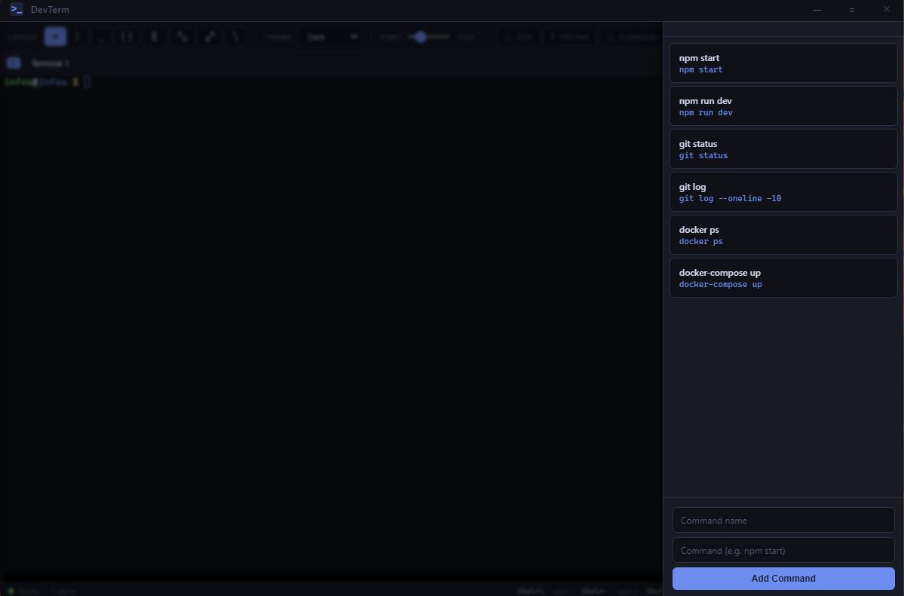
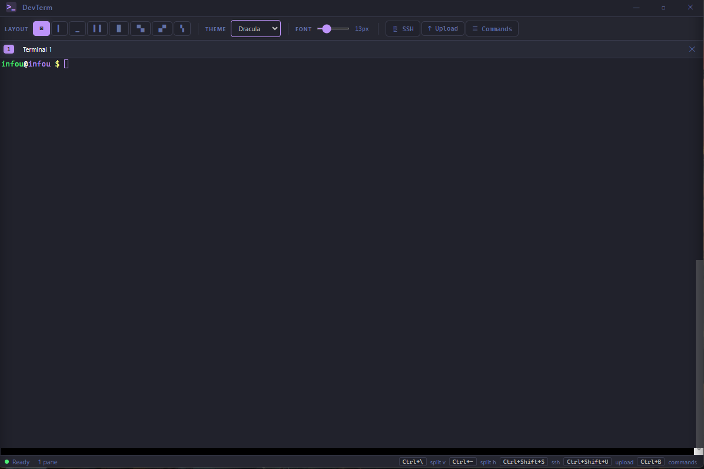
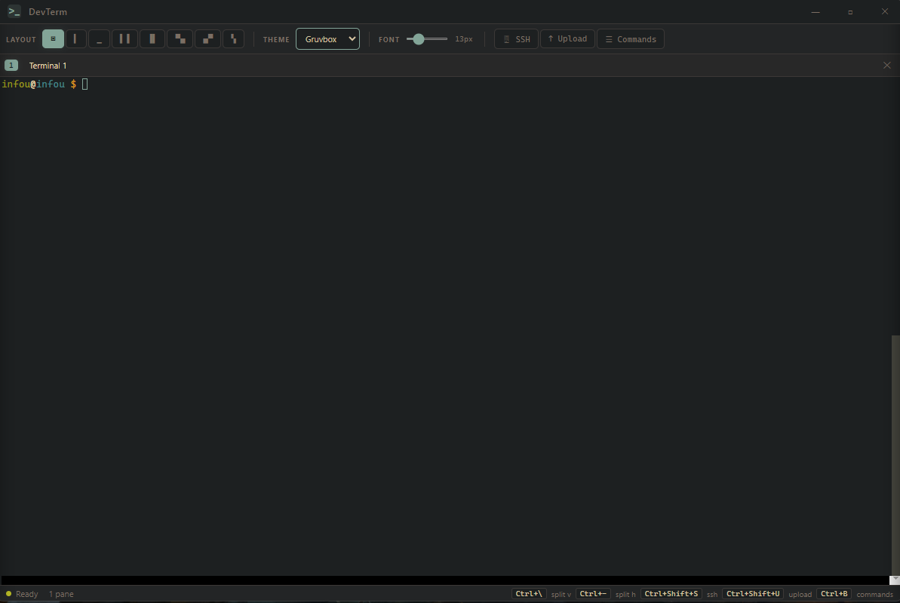

# DevTerm

A modern developer terminal built with Electron, featuring split panes, SSH connections, SFTP file upload with selective file picking, and beautiful themes.


## Screenshots

### Main Terminal


### Split Pane Layouts


### SSH Connection Panel


### SFTP File Upload


### Quick Commands


### Themes
|  |  |
|:---:|:---:|
| Dracula | Gruvbox |

## Features

### Terminal
- Full-featured terminal powered by **xterm.js** and **node-pty**
- Clickable URLs with web-links addon
- Adjustable font size (10px - 24px) with live preview slider
- Auto-fit terminal to pane dimensions
- Single instance lock prevents duplicate windows

### Split Pane Layouts

8 layout modes for multitasking:

| Layout | Description | Panes |
|--------|-------------|-------|
| Single | One full-screen terminal | 1 |
| Split Vertical | Side by side | 2 |
| Split Horizontal | Top and bottom | 2 |
| Left 2 - Right 1 | Two left, one right | 3 |
| Left 1 - Right 2 | One left, two right | 3 |
| Top 1 - Bottom 2 | One top, two bottom | 3 |
| Top 2 - Bottom 1 | Two top, one bottom | 3 |
| Quad | 2x2 grid | 4 |

Each pane operates independently with its own terminal process. Layout switches preserve existing sessions.

### SSH Connections

- Save and manage multiple SSH server profiles
- Connect via **password** or **private key** authentication
- Credentials encrypted with Electron **safeStorage** (DPAPI on Windows)
- Test connection before saving
- Color-coded profiles for easy identification
- SSH sessions open in dedicated panes with an **SSH** badge
- Multiple simultaneous SSH connections supported
- Auto-strips URL protocols (`http://`, `https://`) from host input
- Profiles persist across app restarts (`%APPDATA%/devterm/ssh-profiles.json`)

**How to connect:**
1. Click **SSH** in the toolbar (or `Ctrl+Shift+S`)
2. Click **+ Add Server**
3. Enter host, port, username, and password or key path
4. Click **Test** to verify, then **Save**
5. Click the play button to open an SSH terminal in a new pane

### SFTP File Upload

Upload files and folders to any saved SSH server:

- **File tree selector** with checkboxes to pick specific files and folders
- Exclude unwanted directories (e.g. `node_modules`, `.git`) before upload
- **Select All** / **Deselect All** / **Collapse All** tree controls
- Folders start collapsed for easy navigation of large directories
- Real-time progress bar with file counter
- Smart remote path handling (auto-appends filename to directory paths)
- Choose target server from a dropdown of saved SSH profiles
- Recursive directory upload with automatic remote directory creation

**How to upload:**
1. Click **Upload** in the toolbar (or `Ctrl+Shift+U`), or click the upload icon on an SSH pane header
2. Select the target server from the dropdown
3. Browse for a file or folder
4. For folders: use the file tree to check/uncheck specific items
5. Enter the remote destination path
6. Click **Upload** and watch the progress

### Themes

6 built-in color themes with full terminal ANSI color schemes:

- **Dark** (default)
- **Monokai**
- **Dracula**
- **Nord**
- **Solarized**
- **Gruvbox**

Themes apply to both the UI and terminal. Selection persists across sessions via localStorage.

### Quick Commands

- Save frequently used commands (e.g. `npm start`, `docker-compose up`)
- One-click execution in the active terminal pane
- Add, remove, and manage your command library
- Commands persist in localStorage

### Custom Titlebar

- Frameless window with custom minimize, maximize, and close buttons
- Draggable titlebar area (VS Code style)

## Keyboard Shortcuts

| Shortcut | Action |
|----------|--------|
| `Ctrl+\` | Split vertical |
| `Ctrl+-` | Split horizontal |
| `Ctrl+Shift+S` | Toggle SSH panel |
| `Ctrl+Shift+U` | Open upload modal |
| `Ctrl+B` | Toggle commands panel |
| `Ctrl+1` - `Ctrl+4` | Focus pane 1-4 |
| `Ctrl+W` | Close active pane |
| `Ctrl+Shift+T` | Quad layout |

## Getting Started

### Prerequisites

- **Node.js** 20 or later
- **Windows** (node-pty configured with winpty)
- Build tools for native modules (Visual Studio Build Tools with C++ workload)

### Install

```bash
git clone https://github.com/ugurcl/devterm.git
cd devterm
npm install
```

### Run

```bash
# Production mode
npm start

# Development mode (DevTools enabled)
npm run dev
```

### Test

```bash
npm test
```

### Build

```bash
# Create Windows installer (.exe)
npm run build

# Create unpacked directory
npm run pack
```

The installer is output to the `dist/` folder as `DevTerm-Setup-{version}.exe`.

## Project Structure

```
devterm/
├── src/
│   ├── main/
│   │   ├── main.js              # Electron main process, window creation
│   │   ├── config.js            # App paths, default settings
│   │   ├── terminal-manager.js  # Local terminal (node-pty) lifecycle
│   │   ├── ssh-manager.js       # SSH connections (ssh2), SFTP upload
│   │   ├── credential-store.js  # Encrypted credential storage (safeStorage)
│   │   └── ipc-handlers.js      # All IPC channel handlers
│   ├── preload/
│   │   └── preload.js           # Context bridge API (electronAPI)
│   └── renderer/
│       ├── index.html           # Main UI template
│       ├── css/
│       │   ├── themes.css       # Theme CSS custom properties
│       │   ├── titlebar.css     # Custom titlebar styles
│       │   ├── style.css        # Main layout, toolbar, statusbar
│       │   └── ssh.css          # SSH panel, upload modal, file tree
│       └── js/
│           ├── app.js           # App controller, pane management
│           ├── terminal-bridge.js # xterm.js ↔ IPC bridge
│           ├── theme.js         # Theme and font size management
│           ├── ssh-panel.js     # SSH panel, upload modal, file tree UI
│           ├── commands.js      # Quick commands panel
│           ├── shortcuts.js     # Keyboard shortcut bindings
│           └── titlebar.js      # Window control buttons
├── tests/
│   ├── terminal-manager.test.js
│   ├── ssh-manager.test.js
│   ├── credential-store.test.js
│   └── config.test.js
├── assets/
│   └── icon.ico
├── electron-builder.yml
└── package.json
```

## IPC Channels

| Channel | Direction | Purpose |
|---------|-----------|---------|
| `terminal:create` | renderer → main | Create local terminal |
| `terminal:create-ssh` | renderer → main | Create SSH terminal |
| `terminal:input` | renderer → main | Send keystrokes |
| `terminal:resize` | renderer → main | Resize terminal |
| `terminal:close` | renderer → main | Close terminal |
| `terminal:output` | main → renderer | Terminal output data |
| `terminal:exit` | main → renderer | Terminal process exit |
| `ssh:get-profiles` | renderer → main | List saved profiles |
| `ssh:save-profile` | renderer → main | Save/update profile |
| `ssh:delete-profile` | renderer → main | Delete profile |
| `ssh:test-connection` | renderer → main | Test SSH connection |
| `ssh:upload` | renderer → main | Upload files via SFTP |
| `ssh:upload-progress` | main → renderer | Upload progress updates |
| `dialog:select-file` | renderer → main | Native file picker |
| `dialog:select-folder` | renderer → main | Native folder picker |
| `dialog:read-directory` | renderer → main | Read directory tree |

## Security

- **Context Isolation** enabled with a strict preload bridge
- **Content Security Policy**: `default-src 'self'; style-src 'self' 'unsafe-inline'; font-src 'self'`
- SSH credentials encrypted at rest using Electron **safeStorage** (Windows DPAPI)
- No `nodeIntegration` in renderer process
- Single instance lock prevents multiple app windows

## Tech Stack

| Component | Technology |
|-----------|------------|
| Framework | Electron 33 |
| Terminal | xterm.js 6 + node-pty |
| SSH/SFTP | ssh2 |
| Encryption | Electron safeStorage (DPAPI) |
| Testing | Jest |
| Linting | ESLint |
| Packaging | electron-builder (NSIS) |

## License

MIT
